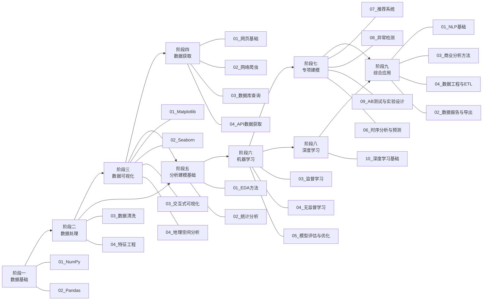

# 项目概览

> 📖 **文档导航**：[学习路线](01_学习路线.md) · [模块详解](02_模块详解.md) · [项目概览](03_项目概览.md) · [架构设计](04_架构设计.md) · [开发指南](05_开发指南.md) · [依赖管理](06_依赖管理.md)

## 项目定位

本项目是一个**按数据分析工作流组织的 Python 数据分析案例学习项目**，旨在通过结构化的案例驱动方式，帮助学习者系统掌握数据分析全流程技能。

**目标受众：**

- 希望转向数据分析方向的 Python 学习者
- 初级数据分析师
- 在校学生

---

## 学习路线总览



---

## 目录结构

```
python-data-analysis/
├── 02_数据处理/          ← 阶段一·数据基础 + 阶段二·数据处理
│   ├── 01_NumPy/
│   ├── 02_Pandas/
│   ├── 03_数据清洗/
│   └── 04_特征工程/
├── 03_数据可视化/        ← 阶段三·数据可视化
│   ├── 01_Matplotlib/
│   ├── 02_Seaborn/
│   ├── 03_交互式可视化/
│   └── 04_地理空间分析/
├── 01_数据获取/          ← 阶段四·数据获取（可后置）
│   ├── 01_网页基础/
│   ├── 02_网络爬虫/
│   ├── 03_数据库查询/
│   └── 04_API数据获取/
├── 04_分析建模/          ← 阶段五~八·分析建模
│   ├── 01_EDA方法/
│   ├── 02_统计分析/
│   ├── 03_监督学习/
│   ├── 04_无监督学习/
│   ├── 05_模型评估与优化/
│   ├── 06_时序分析与预测/
│   ├── 07_推荐系统/
│   ├── 08_异常检测/
│   ├── 09_AB测试与实验设计/
│   └── 10_深度学习基础/
├── 05_综合应用/          ← 阶段九·综合应用
│   ├── 01_NLP基础/
│   ├── 02_数据报告与导出/
│   ├── 03_商业分析方法/
│   └── 04_数据工程与ETL/
└── docs/
```

---

## 技术栈一览

| 阶段 | 核心依赖库 |
|------|-----------|
| 阶段一 数据基础 | numpy, pandas |
| 阶段二 数据处理 | pandas, scikit-learn, scipy |
| 阶段三 数据可视化 | matplotlib, seaborn, plotly, geopandas, folium |
| 阶段四 数据获取 | requests, beautifulsoup4, sqlalchemy, httpx |
| 阶段五 分析建模基础 | pandas, scikit-learn, scipy, statsmodels, ydata-profiling |
| 阶段六 机器学习 | scikit-learn, scipy |
| 阶段七 专项建模 | scikit-learn, statsmodels, prophet, scipy |
| 阶段八 深度学习 | torch, numpy |
| 阶段九 综合应用 | jieba, wordcloud, snownlp, fpdf2, openpyxl, nbformat |

---

## 项目数据

| 指标 | 数量 |
|------|------|
| 方向 | 5 |
| 子方向 | 26 |
| .py 案例文件 | 211+ |
| 依赖库 | 23 |
