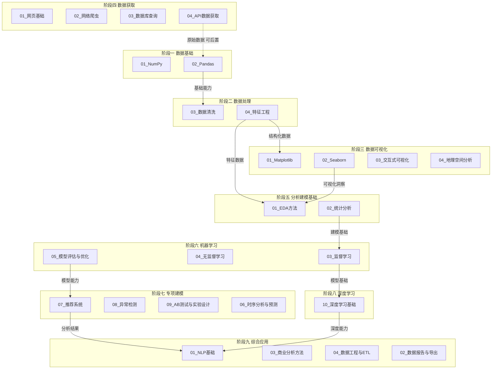
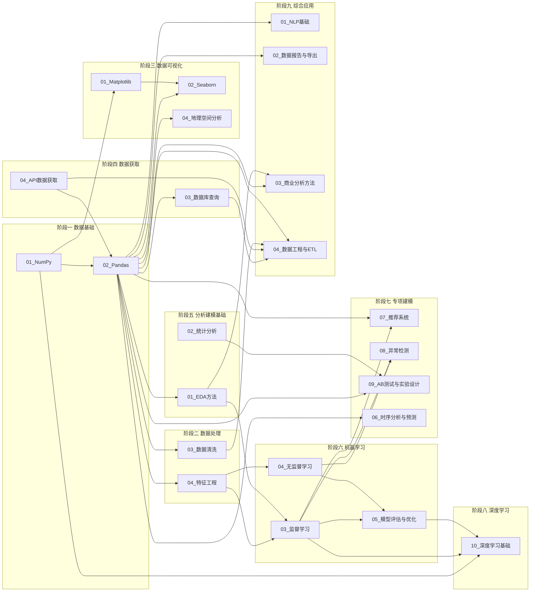
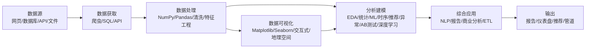
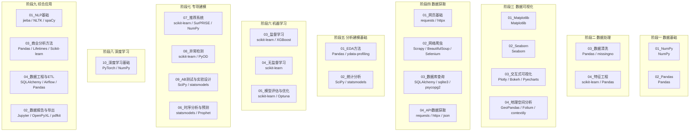
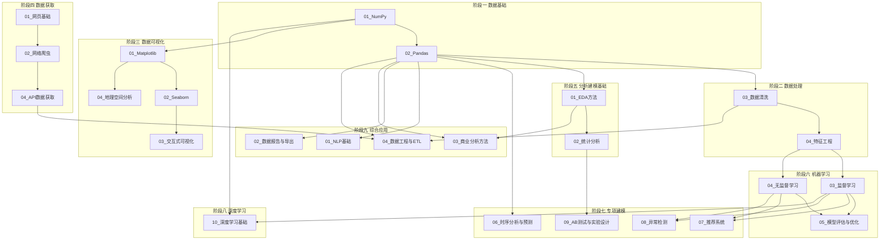
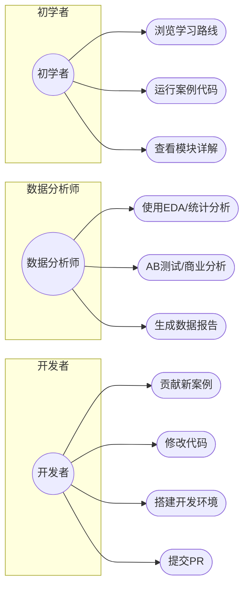
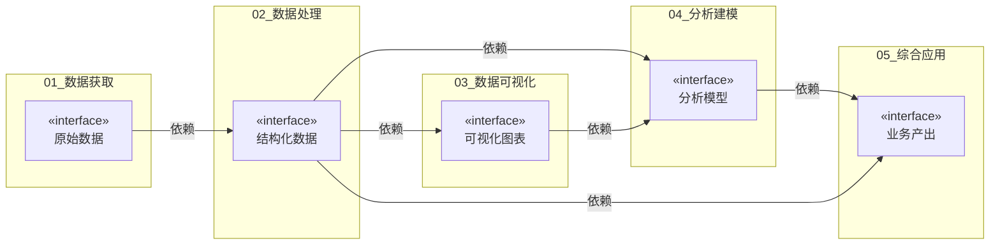
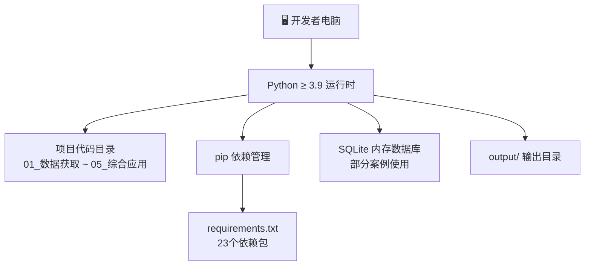
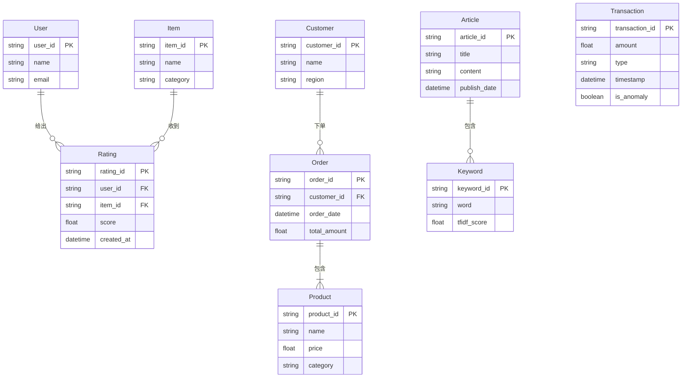
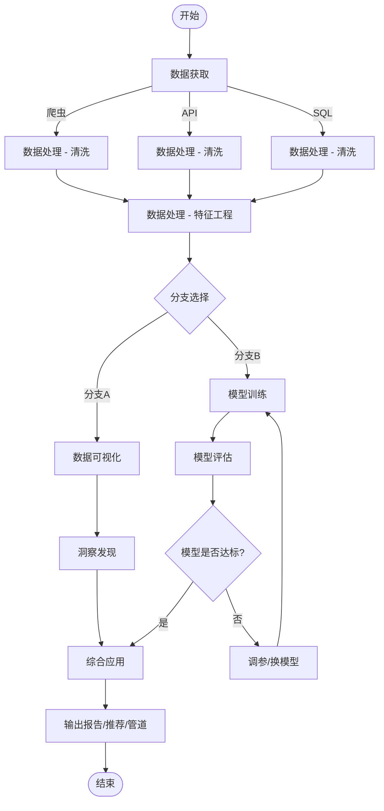

# 架构设计

> 📖 **文档导航**：[学习路线](01_学习路线.md) · [模块详解](02_模块详解.md) · [项目概览](03_项目概览.md) · [架构设计](04_架构设计.md) · [开发指南](05_开发指南.md) · [依赖管理](06_依赖管理.md)

## 一、系统架构图

系统架构图展示了项目的九个学习阶段及其子方向，以及阶段之间的工作流关系。从数据基础起步，经数据处理、数据可视化、数据获取（可后置），进入分析建模基础、机器学习、专项建模、深度学习，最终到达综合应用阶段，形成完整的分析闭环。



## 二、模块依赖图

模块依赖图揭示了各学习阶段中子模块之间的技术依赖关系。Pandas 作为核心枢纽，向上依赖 NumPy，向下支撑数据清洗、特征工程、EDA、时序分析、NLP、推荐系统、AB 测试和报告导出等多个模块；Seaborn 同时依赖 Matplotlib 和 Pandas；特征工程的产出直接驱动监督学习和无监督学习建模；API 数据获取与 ETL 管道形成数据工程闭环；推荐系统和异常检测依赖监督学习与无监督学习的基础能力；深度学习基础以 NumPy 为底座并延伸自监督学习。



## 三、数据流图

数据流图描述了数据从外部来源到最终输出的完整流转路径。原始数据通过爬虫、API 接口或 SQL 查询获取后，经 NumPy/Pandas 进行处理与清洗，再通过可视化工具呈现洞察，随后进入建模分析阶段，最终以 NLP 应用、商业分析、数据报告或 ETL 管道的形式输出成果。



## 四、技术栈关系图

技术栈关系图按学习阶段分组展示了各子模块所涉及的核心库。每个子模块都有其专属的工具链，同时部分库（如 NumPy、Pandas）作为基础设施跨阶段共享。



## 五、学习路径图

学习路径图按九个学习阶段展示了推荐的模块学习顺序及前置依赖关系。阶段一从 NumPy 和 Pandas 打好数据基础；阶段二学习数据清洗与特征工程；阶段三从 Matplotlib 到 Seaborn 再到交互式可视化和地理空间分析；阶段四学习数据获取（可后置）；阶段五掌握 EDA 和统计分析；阶段六进入监督/无监督学习和模型评估；阶段七学习推荐系统、异常检测、AB 测试和时序分析；阶段八学习深度学习基础；阶段九在综合应用中学习 NLP、商业分析、数据工程与报告导出。



## 六、用例图

用例图展示了三类角色与项目功能的交互关系。初学者主要关注学习与探索，通过浏览学习路线、运行案例代码和查看模块详解来掌握数据分析技能；数据分析师侧重于实际分析工作，使用 EDA、统计分析、AB 测试和商业分析方法产出数据报告；开发者则聚焦于项目贡献与协作，包括贡献新案例、修改代码、搭建开发环境和提交 PR。



## 七、组件图

组件图展示了5大方向作为组件的接口定义与依赖关系。01_数据获取提供「原始数据」接口，是整个数据流的起点；02_数据处理依赖原始数据并提供「结构化数据」接口，是核心枢纽；03_数据可视化依赖结构化数据，提供「可视化图表」接口；04_分析建模同时依赖结构化数据和可视化图表，提供「分析模型」接口；05_综合应用依赖分析模型和结构化数据，提供「业务产出」接口，是最终交付层。



## 八、部署图

部署图展示了项目在本地开发环境的部署结构。开发者电脑作为唯一的执行节点，运行 Python ≥ 3.9 运行时环境；项目代码目录承载全部 211+ 案例文件；pip 依赖管理根据 requirements.txt 安装 23 个依赖包；部分案例使用 SQLite 内存数据库进行数据存储与查询；所有输出结果统一写入 output/ 目录。



## 九、ER图

ER图展示了项目中主要案例涉及的数据实体及其关系。推荐系统案例中，用户对物品产生评分；ETL案例中，客户下单购买商品形成订单；NLP案例中，文章包含多个关键词；异常检测案例中，交易记录独立存在并标注异常状态。这些实体关系覆盖了项目5大方向中典型的数据建模场景。



## 十、活动图

活动图展示了典型数据分析工作流的步骤与分支。数据获取阶段根据来源不同分为爬虫、API、SQL三条路径，汇聚后进入数据处理（清洗与特征工程）；随后工作流分为两条分支——分支A侧重数据可视化与洞察发现，分支B侧重分析建模与模型迭代；模型评估未达标时需调参或换模型重新训练，达标后两条分支汇合进入综合应用，最终输出报告、推荐或管道。



## 十一、状态图

状态图展示了数据从获取到产出的完整状态变迁过程。原始数据经数据清洗/转换变为已清洗状态，再经特征工程变为已特征化状态；此后可进入已分析或已可视化状态，两者之间可相互转换；最终到达已产出状态，完成整个数据分析生命周期。每个状态转换都有明确的触发条件。

```mermaid
stateDiagram-v2
    [*] --> 原始数据: 数据获取完成
    原始数据 --> 已清洗: 数据清洗/转换
    已清洗 --> 已特征化: 特征工程
    已特征化 --> 已分析: 建模分析
    已特征化 --> 已可视化: 可视化呈现
    已可视化 --> 已分析: 可视化洞察驱动建模
    已分析 --> 已可视化: 分析结果可视化
    已分析 --> 已产出: 综合应用输出
    已可视化 --> 已产出: 报告/仪表盘生成
    已产出 --> [*]
