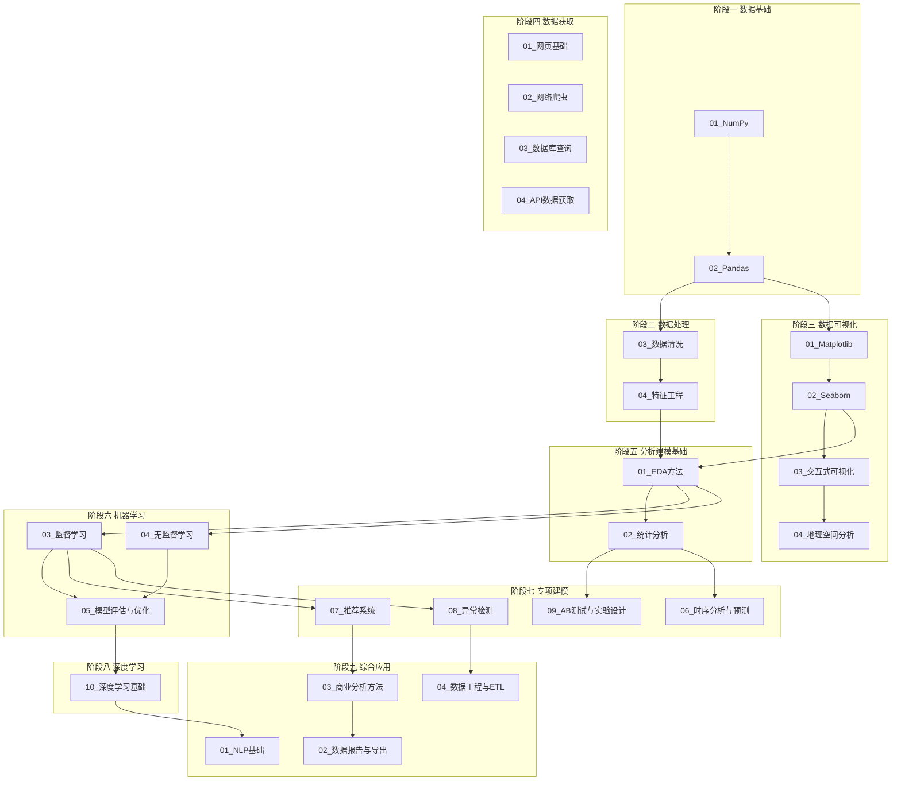

# 学习路线

> 📖 **文档导航**：[项目概览](项目概览.md) · [架构设计](架构设计.md) · [模块详解](模块详解.md) · [学习路线](学习路线.md) · [开发指南](开发指南.md) · [依赖管理](依赖管理.md)

按数据分析工作流组织的统一学习路线。每个阶段同时包含 **📚概念理解层** 和 **💻代码实战层**，学习者根据自身背景选择侧重层即可。

## 如何使用本路线

| 你的背景 | 建议侧重 | 学习方式 |
|---------|---------|---------|
| 🎯 非开发者 | 优先完成📚概念理解层 | 先理解业务含义，💻代码实战层作为进阶 |
| 🎯 开发者 | 优先完成💻代码实战层 | 直接运行代码，📚概念理解层作为速览 |
| 🎯 全栈学习者 | 两层都完成 | 建立从概念到代码的完整认知 |

> 同一阶段内可随时切换层次，无需跳转到其他章节。

---

## 学习路线总览

---

## 阶段一：数据基础

**学习目标**：掌握 Python 数值计算和表格数据处理的核心工具

| 子方向 | 📚 概念理解层 | 💻 代码实战层 | 预计时间 |
|--------|-------------|-------------|----------|
| 01_NumPy | 理解数组与矩阵的概念、广播机制为什么高效、向量化运算替代循环的意义 | [1_创建一个单位矩阵.py](../02_数据处理/01_NumPy/1_创建一个单位矩阵.py) → [4_数组索引与切片.py](../02_数据处理/01_NumPy/4_数组索引与切片.py) → [7_广播机制与向量化运算.py](../02_数据处理/01_NumPy/7_广播机制与向量化运算.py) | 3-4天 |
| 02_Pandas | 理解表格数据模型（行×列）、索引的作用、分组聚合的业务含义 | [1_Series对象创建与操作.py](../02_数据处理/02_Pandas/1_Series对象创建与操作.py) → [4_数据筛选与排序.py](../02_数据处理/02_Pandas/4_数据筛选与排序.py) → [7_分组聚合与透视表.py](../02_数据处理/02_Pandas/7_分组聚合与透视表.py) | 5-7天 |

---

## 阶段二：数据处理

**学习目标**：掌握数据质量保障和特征构建的方法论

| 子方向 | 📚 概念理解层 | 💻 代码实战层 | 预计时间 |
|--------|-------------|-------------|----------|
| 03_数据清洗 | 理解脏数据的类型（缺失/重复/异常/类型错误）、清洗策略的选择逻辑、数据质量对分析结果的影响 | [1_缺失值检测与处理.py](../02_数据处理/03_数据清洗/1_缺失值检测与处理.py) → [3_异常值识别与处理.py](../02_数据处理/03_数据清洗/3_异常值识别与处理.py) → [5_字符串清洗与正则.py](../02_数据处理/03_数据清洗/5_字符串清洗与正则.py) | 3-4天 |
| 04_特征工程 | 理解特征工程的本质（让数据更适合模型）、标准化vs归一化的区别、特征选择的业务直觉 | [1_数据标准化与归一化.py](../02_数据处理/04_特征工程/1_数据标准化与归一化.py) → [3_特征编码方法.py](../02_数据处理/04_特征工程/3_特征编码方法.py) → [6_特征选择方法.py](../02_数据处理/04_特征工程/6_特征选择方法.py) | 3-4天 |

---

## 阶段三：数据可视化

**学习目标**：掌握用图表传达数据洞察的能力

| 子方向 | 📚 概念理解层 | 💻 代码实战层 | 预计时间 |
|--------|-------------|-------------|----------|
| 01_Matplotlib | 理解图表类型的选择逻辑（什么时候用折线/柱状/散点）、图表元素（标题/图例/坐标轴）的作用 | [1_折线图_国民经济数据分析.py](../03_数据可视化/01_Matplotlib/1_折线图_国民经济数据分析.py) → [3_柱状图与饼图.py](../03_数据可视化/01_Matplotlib/3_柱状图与饼图.py) → [5_多子图与布局.py](../03_数据可视化/01_Matplotlib/5_多子图与布局.py) | 4-5天 |
| 02_Seaborn | 理解统计可视化的价值（分布/关系/分类一目了然）、Seaborn与Matplotlib的分工 | [1_热力图与相关性分析.py](../03_数据可视化/02_Seaborn/1_热力图与相关性分析.py) → [3_分布图与回归图.py](../03_数据可视化/02_Seaborn/3_分布图与回归图.py) → [5_分面网格FacetGrid.py](../03_数据可视化/02_Seaborn/5_分面网格FacetGrid.py) | 3-4天 |
| 03_交互式可视化 | 理解交互式图表的优势（缩放/筛选/悬停）、何时选择交互式而非静态图 | [1_Plotly基础图表.py](../03_数据可视化/03_交互式可视化/1_Plotly基础图表.py) → [3_交互式散点图与气泡图.py](../03_数据可视化/03_交互式可视化/3_交互式散点图与气泡图.py) | 2-3天 |
| 04_地理空间分析 | 理解空间数据的特殊性（坐标/区域/密度）、地图可视化的业务场景（物流/零售/城市规划） | [1_地理空间数据基础与GeoPandas.py](../03_数据可视化/04_地理空间分析/1_地理空间数据基础与GeoPandas.py) → [4_Folium交互式地图.py](../03_数据可视化/04_地理空间分析/4_Folium交互式地图.py) | 3-4天 |

---

## 阶段四：数据获取

**学习目标**：掌握从多种数据源获取数据的能力（初学者可先跳过，用现成数据练习后续阶段）

| 子方向 | 📚 概念理解层 | 💻 代码实战层 | 预计时间 |
|--------|-------------|-------------|----------|
| 01_网页基础 | 理解网页的组成（HTML结构/CSS样式/JS交互）、为什么数据分析需要了解网页 | [1_1_最基本的HTML文档结构.html](../01_数据获取/01_网页基础/1_1_最基本的HTML文档结构.html) → [3_CSS选择器与样式基础.html](../01_数据获取/01_网页基础/3_CSS选择器与样式基础.html) | 1-2天 |
| 02_网络爬虫 | 理解爬虫的工作原理（请求→解析→提取）、爬虫的法律与道德边界 | [1_Requests基础与HTTP协议.py](../01_数据获取/02_网络爬虫/1_Requests基础与HTTP协议.py) → [3_BeautifulSoup解析与提取.py](../01_数据获取/02_网络爬虫/3_BeautifulSoup解析与提取.py) | 3-4天 |
| 03_数据库查询 | 理解关系型数据库的概念（表/行/列/主键/外键）、SQL查询的逻辑 | [1_SQLAlchemy连接与基础操作.py](../01_数据获取/03_数据库查询/1_SQLAlchemy连接与基础操作.py) → [3_查询过滤与排序.py](../01_数据获取/03_数据库查询/3_查询过滤与排序.py) | 2-3天 |
| 04_API数据获取 | 理解API的概念（程序间的数据接口）、RESTful API的设计逻辑、JSON数据格式 | [1_REST_API基础与JSON解析.py](../01_数据获取/04_API数据获取/1_REST_API基础与JSON解析.py) → [3_API认证与授权.py](../01_数据获取/04_API数据获取/3_API认证与授权.py) | 2-3天 |

---

## 阶段五：分析建模基础

**学习目标**：掌握探索性分析和统计推断的基本方法

| 子方向 | 📚 概念理解层 | 💻 代码实战层 | 预计时间 |
|--------|-------------|-------------|----------|
| 01_EDA方法 | 理解EDA的核心理念（先看数据再建模）、单变量/双变量/多变量分析分别回答什么问题 | [1_数据概览与基本信息.py](../04_分析建模/01_EDA方法/1_数据概览与基本信息.py) → [3_双变量分析与相关性.py](../04_分析建模/01_EDA方法/3_双变量分析与相关性.py) | 4-5天 |
| 02_统计分析 | 理解描述统计vs推断统计、假设检验的逻辑（p值到底在说什么）、置信区间的含义 | [1_描述统计与数据分布.py](../04_分析建模/02_统计分析/1_描述统计与数据分布.py) → [3_假设检验与显著性.py](../04_分析建模/02_统计分析/3_假设检验与显著性.py) | 4-5天 |

---

## 阶段六：机器学习

**学习目标**：掌握分类、聚类、模型评估的核心方法

| 子方向 | 📚 概念理解层 | 💻 代码实战层 | 预计时间 |
|--------|-------------|-------------|----------|
| 03_监督学习 | 理解监督学习的本质（从标注数据中学习规则）、分类vs回归的区别、各算法的适用场景 | [1_数据集加载与划分.py](../04_分析建模/03_监督学习/1_数据集加载与划分.py) → [3_决策树与随机森林.py](../04_分析建模/03_监督学习/3_决策树与随机森林.py) | 5-7天 |
| 04_无监督学习 | 理解无监督学习的价值（发现隐藏模式）、聚类vs降维的区别、KMeans和DBSCAN的适用场景 | [1_KMeans聚类分析.py](../04_分析建模/04_无监督学习/1_KMeans聚类分析.py) → [3_PCA降维与可视化.py](../04_分析建模/04_无监督学习/3_PCA降维与可视化.py) | 4-5天 |
| 05_模型评估与优化 | 理解过拟合vs欠拟合、交叉验证为什么重要、超参数调优的策略 | [1_模型评估与交叉验证.py](../04_分析建模/05_模型评估与优化/1_模型评估与交叉验证.py) → [3_超参数调优方法.py](../04_分析建模/05_模型评估与优化/3_超参数调优方法.py) | 4-5天 |

---

## 阶段七：专项建模

**学习目标**：掌握特定领域的高级分析方法（根据兴趣选择1-3个方向）

| 子方向 | 📚 概念理解层 | 💻 代码实战层 | 预计时间 |
|--------|-------------|-------------|----------|
| 07_推荐系统 | 理解推荐的原理（相似用户/相似物品/隐因子）、冷启动问题、推荐多样性 | [1_推荐系统概述与数据准备.py](../04_分析建模/07_推荐系统/1_推荐系统概述与数据准备.py) → [2_基于用户的协同过滤.py](../04_分析建模/07_推荐系统/2_基于用户的协同过滤.py) | 3-4天 |
| 08_异常检测 | 理解异常的类型（点/上下文/集合）、不同检测方法的适用场景 | [1_异常检测概述与统计方法.py](../04_分析建模/08_异常检测/1_异常检测概述与统计方法.py) → [3_Isolation_Forest隔离森林.py](../04_分析建模/08_异常检测/3_Isolation_Forest隔离森林.py) | 3-4天 |
| 09_AB测试与实验设计 | 理解AB测试的统计逻辑、p值的正确解读、样本量为什么重要 | [1_AB测试原理与假设检验.py](../04_分析建模/09_AB测试与实验设计/1_AB测试原理与假设检验.py) → [4_样本量计算与功效分析.py](../04_分析建模/09_AB测试与实验设计/4_样本量计算与功效分析.py) | 3-4天 |
| 06_时序分析与预测 | 理解时间序列的组成（趋势/季节/残差）、平稳性的含义、预测的不确定性 | [1_时间序列基础与预处理.py](../04_分析建模/06_时序分析与预测/1_时间序列基础与预处理.py) → [4_Prophet预测模型.py](../04_分析建模/06_时序分析与预测/4_Prophet预测模型.py) | 4-5天 |

---

## 阶段八：深度学习

**学习目标**：理解神经网络的基本原理，能搭建简单的深度学习模型

| 子方向 | 📚 概念理解层 | 💻 代码实战层 | 预计时间 |
|--------|-------------|-------------|----------|
| 10_深度学习基础 | 理解神经网络的前向传播/反向传播、激活函数的作用、过拟合的应对策略 | [1_神经网络基本原理与PyTorch入门.py](../04_分析建模/10_深度学习基础/1_神经网络基本原理与PyTorch入门.py) → [5_全连接网络分类实战.py](../04_分析建模/10_深度学习基础/5_全连接网络分类实战.py) | 5-7天 |

---

## 阶段九：综合应用

**学习目标**：将前面所学整合为完整的分析项目（根据兴趣选择1-3个方向）

| 子方向 | 📚 概念理解层 | 💻 代码实战层 | 预计时间 |
|--------|-------------|-------------|----------|
| 01_NLP基础 | 理解文本分析的基本流程（分词→向量化→建模）、TF-IDF的直觉含义 | [1_文本读取与编码处理.py](../05_综合应用/01_NLP基础/1_文本读取与编码处理.py) → [3_TF-IDF与关键词提取.py](../05_综合应用/01_NLP基础/3_TF-IDF与关键词提取.py) | 4-5天 |
| 03_商业分析方法 | 理解漏斗/同期群/留存/RFM的业务含义、这些方法回答什么业务问题 | [1_漏斗分析与转化率.py](../05_综合应用/03_商业分析方法/1_漏斗分析与转化率.py) → [4_RFM模型与用户价值分层.py](../05_综合应用/03_商业分析方法/4_RFM模型与用户价值分层.py) | 4-5天 |
| 04_数据工程与ETL | 理解ETL的概念（抽取→转换→加载）、数据管道的设计逻辑、增量更新的必要性 | [1_ETL流程设计与数据管道.py](../05_综合应用/04_数据工程与ETL/1_ETL流程设计与数据管道.py) → [5_增量更新与数据校验.py](../05_综合应用/04_数据工程与ETL/5_增量更新与数据校验.py) | 4-5天 |
| 02_数据报告与导出 | 理解数据报告的结构（结论→方法→数据）、自动化的价值 | [1_数据报告生成基础.py](../05_综合应用/02_数据报告与导出/1_数据报告生成基础.py) → [3_自动化报告生成.py](../05_综合应用/02_数据报告与导出/3_自动化报告生成.py) | 2-3天 |

---

## 学习时间估算

| 角色 | 必修阶段 | 选修阶段 | 总计时间 |
|------|---------|---------|---------|
| 非开发者 | 阶段1-5（📚概念理解层） | 阶段6-9（📚概念理解层） | 约6-8周 |
| 开发者 | 阶段1-6（💻代码实战层） | 阶段7-9（💻代码实战层） | 约12-16周 |
| 全栈学习者 | 阶段1-9（两层都完成） | — | 约16-20周 |

> 按每天学习2-3小时计算。阶段七和阶段九为选修，可根据兴趣选择1-3个方向。

---

## 学习建议

1. **先跑通再理解** — 不要一开始就追求理解每一行代码，先运行案例看到输出，再回头理解逻辑
2. **修改参数观察变化** — 把案例中的参数改一改，观察输出变化，这是最快的理解方式
3. **阶段四可后置** — 数据获取技能可以先用现成数据练习后续阶段，再回头补充
4. **概念层不等于简单** — 概念理解层需要深入思考"为什么"，这是数据分析的核心能力
5. **做笔记** — 每学完一个子方向，用自己的话总结核心要点

## 常见问题

**Q: 我完全没有编程基础，能学吗？**
A: 可以。先按📚概念理解层学习阶段1-5，理解数据分析的思维框架。当你想动手实践时，从阶段三的可视化案例开始——修改图表参数、观察输出变化是最友好的入门方式。

**Q: 阶段七的4个方向都要学吗？**
A: 不需要。根据你的工作需求选择：做产品推荐选推荐系统，做风控选异常检测，做增长选AB测试，做预测选时序分析。

**Q: 深度学习基础是必学的吗？**
A: 对于传统数据分析工作，阶段1-6已经足够。深度学习是进阶方向，适合想往AI方向发展的学习者。

**Q: 学完这个项目能达到什么水平？**
A: 完成必修阶段后，你能独立完成一个完整的数据分析项目（从数据获取到报告输出）。完成全栈路线后，你具备数据分析师岗位的核心技能。
