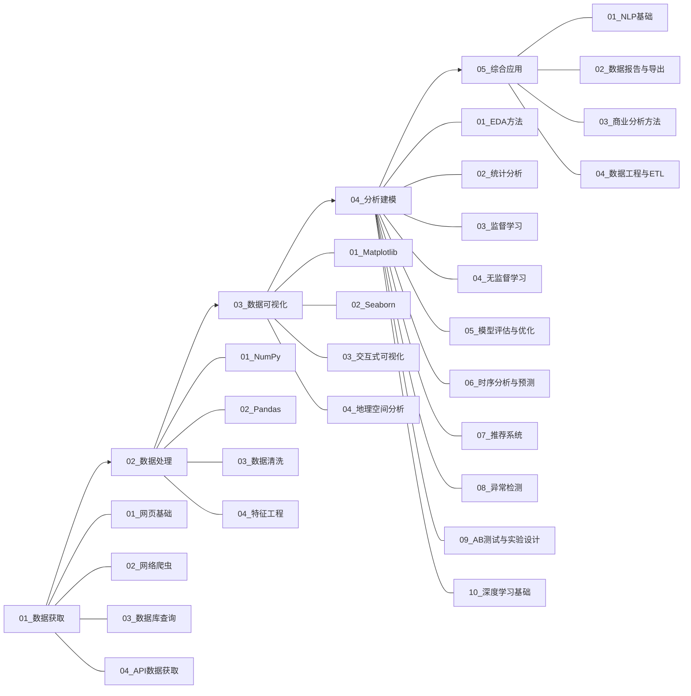

# 项目概览

> 📖 **文档导航**：[项目概览](项目概览.md) · [架构设计](架构设计.md) · [模块详解](模块详解.md) · [学习路线](学习路线.md) · [开发指南](开发指南.md) · [依赖管理](依赖管理.md)

## 项目定位

本项目是一个**按数据分析工作流组织的 Python 数据分析案例学习项目**，旨在通过结构化的案例驱动方式，帮助学习者系统掌握数据分析全流程技能。

**目标受众：**

- 希望转向数据分析方向的 Python 学习者
- 初级数据分析师
- 在校学生

---

## 学习路线总览



---

## 目录结构

```
python-data-analysis/
├── 01_数据获取/
│   ├── 01_网页基础/          (6 files)
│   ├── 02_网络爬虫/          (10 .py)
│   ├── 03_数据库查询/        (9 .py)
│   └── 04_API数据获取/       (7 .py)
├── 02_数据处理/
│   ├── 01_NumPy/             (10 .py)
│   ├── 02_Pandas/            (13 .py)
│   ├── 03_数据清洗/          (6 .py)
│   └── 04_特征工程/          (8 .py)
├── 03_数据可视化/
│   ├── 01_Matplotlib/        (14 .py)
│   ├── 02_Seaborn/           (10 .py)
│   ├── 03_交互式可视化/      (9 .py)
│   └── 04_地理空间分析/      (7 .py)
├── 04_分析建模/
│   ├── 01_EDA方法/           (10 .py)
│   ├── 02_统计分析/          (11 .py)
│   ├── 03_监督学习/          (6 .py)
│   ├── 04_无监督学习/        (6 .py)
│   ├── 05_模型评估与优化/    (6 .py)
│   ├── 06_时序分析与预测/    (9 .py)
│   ├── 07_推荐系统/          (7 .py)
│   ├── 08_异常检测/          (7 .py)
│   ├── 09_AB测试与实验设计/  (7 .py)
│   └── 10_深度学习基础/      (7 .py)
├── 05_综合应用/
│   ├── 01_NLP基础/           (9 .py)
│   ├── 02_数据报告与导出/    (8 .py)
│   ├── 03_商业分析方法/      (8 .py)
│   └── 04_数据工程与ETL/     (7 .py)
└── docs/
```

---

## 技术栈一览

| 方向 | 核心依赖库 |
|------|-----------|
| 01_数据获取 | requests, beautifulsoup4, sqlite3, sqlalchemy, httpx |
| 02_数据处理 | numpy, pandas, scikit-learn, scipy |
| 03_数据可视化 | matplotlib, seaborn, plotly, pyecharts, bokeh, dash, geopandas, folium |
| 04_分析建模 | scikit-learn, statsmodels, prophet, scipy, torch |
| 05_综合应用 | jieba, wordcloud, snownlp, fpdf2, openpyxl, nbformat |

---

## 项目数据

| 指标 | 数量 |
|------|------|
| 方向 | 5 |
| 子方向 | 26 |
| .py 案例文件 | 211+ |
| 依赖库 | 23 |
